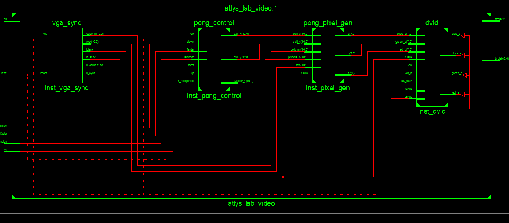

# Lab 2 #
## Table of Contents ##
- [Introduction](#introduction)
- [Approach](#approach)
- [Implementation](#implementation)
    - [Diagram](#diagram)
    - [State Machines/Registers](#state-machines-and-registers)
    - [Combinational Logic](#combinational-logic)
- [Testing and Debugging](#testing-and-debugging)
    - [Ball Speed Problem](#ball-speed-problem)
    - [Ball Teleportation Problem](#ball-teleportation-problem)
    - [Paddle Responsiveness](#paddle-responsiveness)
- [Conclusion](#conclusion)
- [Documentation](#documentation)


## Introduction ##
The purpose of this lab was to use the VGA driver previously implemented in order to implement a simplified version of the classic Pong game.  This lab was based a FSM lab from the 6.1111 MIT course.  To verify that the pong functionality had been fully met, several grading criteria were used.  The game needed to implement:

 1. A moving button controlled paddle  
 2. An end game state when the user missed the ball and it hit the left wall  
 3. The ball bouncing off the top, right and bottom wall  
 4. A switch to increase the speed of the ball
 5. Ball bounce determined from the position of the paddle it hits 

## Approach ##

## Implementation ##
For the Pong control module that needed to be implemented, there were and always are two main sections.  The decision to attempt this using mostly combinational logic significantly reduced the process statement side of the project.
### Diagram ###

### State Machines and Registers ###
For this project, no state machines were used.  The only implementation of memory was setting each of the different elements to the output of the combinational logic on the rising edge of the clock.  An example follows:
```vhdl
process (clk, reset) is
begin
    ...
	elsif (rising_edge(clk)) then
		x_reg <= x_next;
		y_reg <= y_next;
		posX <= posX_next;
		posY <= posY_next;
		posPad<= posPad_next;
	end if;
end process;
```

> **Alert!** Some errors [ Item Driving Multiple Lines] were encountered when trying to include the counter in the same process statement

The Counter followed very similar logic as above.  To make sure that the counter works correctly, it increments each time the v_completed signal is sent.  The value 1001 was chosen since that worked out to be a relatively good speed to have everything updating on the speed.  The relevant code is:
```vhdl
	elsif(rising_edge(clk) and v_completed='1') then
		if(count_reg=1001) then
```
In addition, the ball had three distinct states for both the Y and the X direction: pos, neg, over.  Separating them from the alternative PosXPosY allowed for much simpler combinational statements later on.
### Combinational Logic ###
The position of the ball, the direction the ball should be moving, and paddle position were each determined using large blocks of combinational logic.  The next state for the ball was determined using the current location of the ball.  The following is how the new X state for the ball should be chosen
```vhdl
	x_next<= over when x_reg=over else
				over when ((posY+ball_width<posPad) and posX-ball_width<=1) or ((posY-ball_width>posPad+paddle_height) and posX-ball_width<=1) else
				pos when posX<=ball_width else
				neg when posX>=screen_width-ball_width else
				pos when ((posY<posPad+paddle_height) and (posY>posPad)) and (posX-ball_width<paddle_width) else
				x_reg;
```
The code originally was very nice to work with at basic functionality, but as the speed and direction based on position the ball hit the paddle were implemented, it got much more complicated as shown above.

Similar complications are shown in the following example for how the actual X position for the ball would be chosen.
```vhdl
   posX_next <= posX when x_reg = over else
					 posX + 1  when ((x_reg = pos) and (count_reg=1000)) or ( x_reg=pos and faster ='1' and (count_reg mod 200 =0)) else
					 posX - 1  when (count_reg=1000 and x_reg=neg) or (faster='1' and (count_reg mod 200 =0) and x_reg=neg) else
					 posX;
```
## Testing and Debugging ###
Several issues arose during the implementation of the Pong control.
### Ball Speed Problem ###
The first significant problem was the movement speed of the ball being incredibly fast.  After testing a couple different methods, using a counter with the V_Completed signal allowed for the speed of the ball to be slowed down to a reasonable speed.  The follow fix is contained in a process statement to ensure it stays synchronous.  The magic number in this instance should be replaced during a refactor of the code.
```vhdl
1 elsif(rising_edge(clk) and v_completed='1') then
2  			if(count_reg=1001) then
3  				count_reg <= (others=>'1');
4  			else
5  				count_reg <= count_next;
6  			end if;
7  		end if;
```
### Ball Teleportation Problem ###
However, the keen eye might see that the above code introduced a new bug into the code.  The code segment on line 3 failed to reset the counter back to zero, causing the signal containing the counter to run over and eventually start back at zero.  Again, the problem could be pinpointed to line three in this code:
```vhdl
2  			if(count_reg=1001) then
3  				count_reg <= (others=>'1');
```
### Paddle Responsiveness ###
The combinational method used to implement the paddle introduced lack of responsiveness to the code.  The offending code is as follow
```vhdl
1	posPad_next <= posPad + 10 when down='1' and posPad<430 and count_reg=1000 else
2						posPad -10 when up='1' and posPad>10 and count_reg=1000 else
3 						posPad;
```
Since the above code only allowed the position to be change don every 1000th v_completed cycle, the user could quickly press the button anywhere between the 1-999th cycle, which proved to be quite common.  It is possible to mitigate this problem by increasing the polling frequency, but might not be so in future applications.  At this point, the need for constants becomes apparant ad the combination blocks grow in size.
```vhdl
1	posPad_next <= posPad + 1 when down='1' and posPad<screen_height-paddle_height and (count_reg mod 100=0) else
2						posPad -1 when up='1' and posPad>0 and (count_reg mod 100 =0) else
3						posPad;
```
## Conclusion ##
The amount of time needed to implement full functionality for this lab was much less than the first.  This most likely can be attributed to significant decrease in the amount of process statements that were used to implement the design.  The use of constants and a working change log in the current working VHDL file help keep things sane as the amount of code grew in size.  
## Documentation ##
None